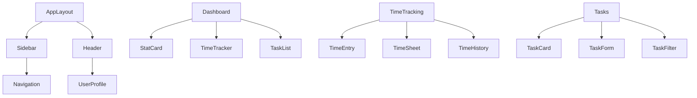

# Component Structure Documentation

## Core Components

### Layout Components

```plaintext
src/
└── components/
    ├── Layout/
    │   ├── AppLayout.tsx         # Main application layout
    │   ├── Sidebar.tsx          # Navigation sidebar
    │   └── Header.tsx           # Top header bar
    │
    ├── Common/
    │   ├── Button/
    │   │   ├── Button.tsx       # Reusable button component
    │   │   └── types.ts         # Button component types
    │   │
    │   ├── Input/
    │   │   ├── Input.tsx        # Form input component
    │   │   └── types.ts         # Input component types
    │   │
    │   ├── Select/
    │   │   ├── Select.tsx       # Dropdown component
    │   │   └── types.ts         # Select component types
    │   │
    │   └── Card/
    │       ├── Card.tsx         # Card container component
    │       └── types.ts         # Card component types
    │
    ├── Dashboard/
    │   ├── StatCard.tsx         # Statistics card
    │   ├── TimeTracker.tsx      # Time tracking widget
    │   └── TaskList.tsx         # Task list component
    │
    ├── TimeTracking/
    │   ├── TimeEntry.tsx        # Time entry form
    │   ├── TimeSheet.tsx        # Weekly timesheet
    │   └── TimeHistory.tsx      # Time entry history
    │
    └── Tasks/
        ├── TaskCard.tsx         # Task detail card
        ├── TaskForm.tsx         # Task creation/edit form
        └── TaskFilter.tsx       # Task filtering component
```

## Page Components

```plaintext
src/
└── pages/
    ├── Login.tsx               # Login page
    ├── Dashboard.tsx           # Employee dashboard
    ├── AdminDashboard.tsx      # Admin dashboard
    ├── TimeTracking.tsx        # Time tracking page
    ├── Tasks.tsx              # Task management page
    ├── Users.tsx              # User management page
    ├── Reports.tsx            # Reports page
    ├── Settings.tsx           # Settings page
    └── Notifications.tsx      # Notifications page
```

## Component Dependencies



## Shared Types

```typescript
// User Types
interface User {
  id: string;
  name: string;
  email: string;
  role: 'admin' | 'employee';
  department: string;
}

// Task Types
interface Task {
  id: string;
  title: string;
  description: string;
  assignedTo: string;
  status: 'todo' | 'in-progress' | 'completed';
  priority: 'low' | 'medium' | 'high';
  dueDate: Date;
}

// Time Entry Types
interface TimeEntry {
  id: string;
  userId: string;
  taskId?: string;
  startTime: Date;
  endTime?: Date;
  duration: number;
  notes?: string;
}

// Project Types
interface Project {
  id: string;
  name: string;
  description: string;
  status: 'active' | 'completed' | 'on-hold';
  startDate: Date;
  endDate?: Date;
}
```

## Component Props Example

```typescript
// Button Component Props
interface ButtonProps {
  variant: 'primary' | 'secondary' | 'danger';
  size: 'sm' | 'md' | 'lg';
  disabled?: boolean;
  loading?: boolean;
  onClick?: () => void;
  children: React.ReactNode;
}

// Card Component Props
interface CardProps {
  title?: string;
  subtitle?: string;
  footer?: React.ReactNode;
  children: React.ReactNode;
  className?: string;
}

// Input Component Props
interface InputProps {
  type: 'text' | 'email' | 'password' | 'number';
  label?: string;
  error?: string;
  value: string | number;
  onChange: (value: string) => void;
  required?: boolean;
  placeholder?: string;
}
```

## Styling Structure

```plaintext
src/
└── styles/
    ├── global.css             # Global styles
    ├── variables.css          # CSS variables
    ├── components/            # Component-specific styles
    │   ├── button.css
    │   ├── input.css
    │   └── card.css
    └── utilities/            # Utility classes
        ├── spacing.css
        ├── typography.css
        └── colors.css
```

## Implementation Guidelines

1. **Component Creation**
   - Use functional components with TypeScript
   - Implement proper type checking
   - Include JSDoc comments for complex components

2. **State Management**
   - Use React hooks for local state
   - Implement context for shared state
   - Consider Redux for complex state management

3. **Styling**
   - Use Tailwind CSS for consistent styling
   - Create reusable utility classes
   - Maintain responsive design principles

4. **Testing**
   - Write unit tests for components
   - Include integration tests
   - Test responsive behavior

5. **Documentation**
   - Include component usage examples
   - Document props and types
   - Maintain changelog for major changes
