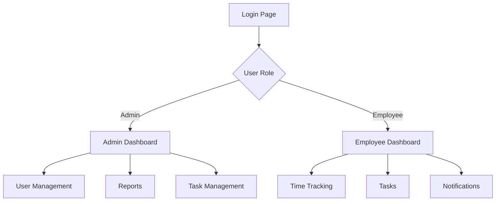

# Zip Mechanical Employee Time Tracking App - UI Documentation

## Table of Contents
1. [Overview](#overview)
2. [Layout Structure](#layout-structure)
3. [Pages](#pages)
4. [Components](#components)
5. [Navigation Flow](#navigation-flow)
6. [Design System](#design-system)
7. [User Roles & Access](#user-roles--access)

## Overview

The Zip Mechanical Employee Time Tracking App is a web application built using React and TypeScript, designed to help manage employee time tracking, task assignments, and project management for HVAC and refrigeration services.



## Layout Structure

### App Layout (`AppLayout.tsx`)
The main layout component that provides:
- Responsive sidebar navigation
- User profile section
- Logo placement
- Mobile-friendly menu

```plaintext
+------------------+--------------------+
|     LOGO         |                   |
+------------------+                   |
|                  |                   |
|   Navigation     |    Main Content   |
|    Sidebar       |                   |
|                  |                   |
|                  |                   |
|   User Profile   |                   |
+------------------+-------------------+
```

## Pages

### 1. Login Page (`Login.tsx`)
- Company logo display
- Email and password inputs
- Error message handling
- Test account information (development only)

### 2. Admin Dashboard (`AdminDashboard.tsx`)
Key features:
- Total employee count
- Active projects overview
- Department statistics
- Recent activities

```plaintext
+------------------+------------------+
|   Employee       |    Project       |
|   Statistics     |    Overview      |
+------------------+------------------+
|                                    |
|        Department Hours            |
|                                    |
+------------------+------------------+
|                                    |
|        Recent Activities           |
|                                    |
+------------------------------------+
```

### 3. Employee Dashboard (`Dashboard.tsx`)
Key features:
- Clock in/out functionality
- Current task list
- Recent time entries
- Notifications

```plaintext
+------------------+------------------+
|   Clock Status   |  Current Tasks   |
+------------------+------------------+
|                                    |
|        Time Entry History          |
|                                    |
+------------------------------------+
|                                    |
|        Notifications              |
|                                    |
+------------------------------------+
```

### 4. User Management Page
Features:
- Employee list
- Add/Edit employee information
- Role assignment
- Department assignment

### 5. Time Tracking Page
Features:
- Time entry form
- Weekly timesheet view
- Time entry history
- Export functionality

### 6. Tasks Page
Features:
- Task list view
- Task details
- Status updates
- Assignment information

### 7. Reports Page (Admin Only)
Features:
- Department hours
- Employee performance
- Project timelines
- Custom report generation

## Components

### 1. Navigation Components
- `Sidebar`: Main navigation menu
- `MobileMenu`: Responsive navigation for mobile devices
- `NavLink`: Custom styled navigation links

### 2. Form Components
- `Input`: Styled input fields
- `Button`: Primary and secondary buttons
- `Select`: Dropdown selection component
- `DatePicker`: Date selection component

### 3. Data Display Components
- `Table`: Data table with sorting and filtering
- `Card`: Information card component
- `Chart`: Data visualization component
- `Badge`: Status and role indicators

### 4. Utility Components
- `Modal`: Popup dialogs
- `Toast`: Notification messages
- `Loading`: Loading indicators
- `ErrorBoundary`: Error handling component

## Design System

### Colors
- Primary: #4F46E5 (Indigo)
- Secondary: #6B7280 (Gray)
- Success: #10B981 (Green)
- Warning: #F59E0B (Yellow)
- Error: #EF4444 (Red)
- Background: #F3F4F6 (Light Gray)

### Typography
- Font Family: Inter
- Headings: 
  - H1: 2.25rem (36px)
  - H2: 1.875rem (30px)
  - H3: 1.5rem (24px)
- Body: 1rem (16px)
- Small: 0.875rem (14px)

### Spacing
- Base unit: 4px
- Common spacing values:
  - xs: 4px
  - sm: 8px
  - md: 16px
  - lg: 24px
  - xl: 32px

## User Roles & Access

### Admin
- Full access to all features
- User management capabilities
- Report generation
- System configuration

### Employee
- Limited access to personal features
- Time tracking
- Task management
- Personal reports

## Implementation Notes

### State Management
- React Context for user authentication
- Local state for form handling
- Redux for complex state management (if needed)

### API Integration
- RESTful API endpoints
- JWT authentication
- Real-time updates for notifications

### Testing Strategy
- Unit tests for components
- Integration tests for workflows
- E2E tests for critical paths
