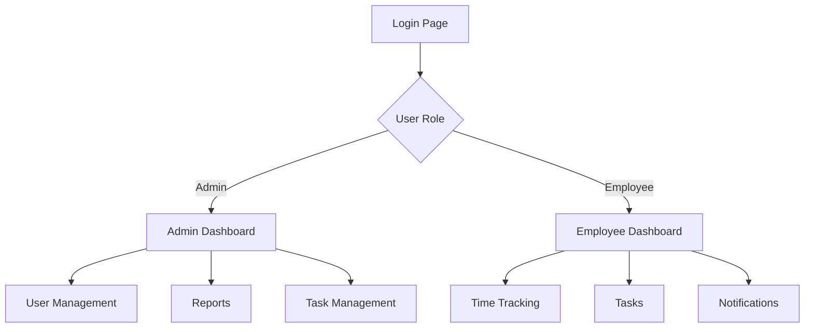

# Employee Time Tracking App - UI Documentation

## Table of Contents
1. [Overview](#overview)
2. [Layout Structure](#layout-structure)
3. [Pages](#pages)
4. [Components](#components)
5. [Navigation Flow](#navigation-flow)
6. [Design System](#design-system)
7. [User Roles & Access](#user-roles--access)
8. [Admin Workflows](#admin-workflows)

## Overview

The Employee Time Tracking App is a web application built using React and TypeScript, designed to help manage employee time tracking, task assignments, and project management for small business services.



## Layout Structure

### App Layout (`AppLayout.tsx`)
The main layout component that provides:
- Responsive sidebar navigation
- User profile section
- Logo placement
- Mobile-friendly menu

```plaintext
+------------------+--------------------+
|     LOGO         |                   |
+------------------+                   |
|                  |                   |
|   Navigation     |    Main Content   |
|    Sidebar       |                   |
|                  |                   |
|                  |                   |
|   User Profile   |                   |
+------------------+-------------------+
```

## Pages

### 1. Login Page (`Login.tsx`)
- Company logo display
- Email and password inputs
- Error message handling
- Test account information (development only)

### 2. Admin Dashboard (`AdminDashboard.tsx`)
Key features:
- Total employee count
- Active projects overview
- Department statistics
- Recent activities

```plaintext
+------------------+------------------+
|   Employee       |    Project       |
|   Statistics     |    Overview      |
+------------------+------------------+
|                                    |
|        Department Hours            |
|                                    |
+------------------+------------------+
|                                    |
|        Recent Activities           |
|                                    |
+------------------------------------+
```

### 3. Employee Dashboard (`Dashboard.tsx`)
Key features:
- Clock in/out functionality
- Current task list
- Recent time entries
- Notifications

```plaintext
+------------------+------------------+
|   Clock Status   |  Current Tasks   |
+------------------+------------------+
|                                    |
|        Time Entry History          |
|                                    |
+------------------------------------+
|                                    |
|        Notifications              |
|                                    |
+------------------------------------+
```

### 4. User Management Page
Features:
- Employee list
- Add/Edit employee information
- Role assignment
- Department assignment

### 5. Time Tracking Page
Features:
- Time entry form
- Weekly timesheet view
- Time entry history
- Export functionality

### 6. Tasks Page
Features:
- Task list view
- Task details
- Status updates
- Assignment information

### 7. Reports Page (Admin Only)
Features:
- Department hours
- Employee performance
- Project timelines
- Custom report generation

## Components

### 1. Navigation Components
- `Sidebar`: Main navigation menu
- `MobileMenu`: Responsive navigation for mobile devices
- `NavLink`: Custom styled navigation links

### 2. Form Components
- `Input`: Styled input fields
- `Button`: Primary and secondary buttons
- `Select`: Dropdown selection component
- `DatePicker`: Date selection component

### 3. Data Display Components
- `Table`: Data table with sorting and filtering
- `Card`: Information card component
- `Chart`: Data visualization component
- `Badge`: Status and role indicators

### 4. Utility Components
- `Modal`: Popup dialogs
- `Toast`: Notification messages
- `Loading`: Loading indicators
- `ErrorBoundary`: Error handling component

### 5. Schedule Template System
The Schedule Template feature allows administrators to create and apply predefined work schedules:

#### ScheduleTemplateApplyModal
- Purpose: Applies a schedule template to a specific date range
- Features:
  - Date range selection
  - Duration selection (default: 1 week)
  - Preview of schedule to be applied
  - Confirmation dialog

### 6. Time Entry Management

#### TimeEntryEditModal
- Modal for editing individual time entries
- Supports modification of:
  - Start and end times
  - Break duration
  - Task assignment
  - Notes

#### TimeEntryForm
- Reusable form component for time entry creation/editing
- Validates time entry data
- Handles break calculations

### 7. Timesheet Management

#### TimesheetEditModal
- Comprehensive timesheet editing interface
- Features:
  - Bulk time entry editing
  - Weekly hour calculations
  - Status updates

#### TimesheetRejectModal
- Handles timesheet rejection workflow
- Requires rejection reason
- Notifies employee of rejection

### 8. Task Management

#### TaskAssignmentModal
- Interface for assigning tasks to employees
- Features:
  - Employee selection
  - Due date setting
  - Priority level
  - Task description and requirements

### 9. User Management

#### UserFormModal
- Handles user creation and editing
- Fields include:
  - Personal information
  - Role assignment
  - Department assignment
  - Access permissions

### 10. Authentication

#### LogoutModal
- Confirmation dialog for user logout
- Handles session cleanup
- Option to stay logged in

## Design System

### Colors
- Primary: #4F46E5 (Indigo)
- Secondary: #6B7280 (Gray)
- Success: #10B981 (Green)
- Warning: #F59E0B (Yellow)
- Error: #EF4444 (Red)
- Background: #F3F4F6 (Light Gray)

### Typography
- Font Family: Inter
- Headings: 
  - H1: 2.25rem (36px)
  - H2: 1.875rem (30px)
  - H3: 1.5rem (24px)
- Body: 1rem (16px)
- Small: 0.875rem (14px)

### Spacing
- Base unit: 4px
- Common spacing values:
  - xs: 4px
  - sm: 8px
  - md: 16px
  - lg: 24px
  - xl: 32px

## User Roles & Access

### Admin
- Full access to all features
- User management capabilities
- Report generation
- System configuration

### Employee
- Limited access to personal features
- Time tracking
- Task management
- Personal reports

## Admin Workflows

### 1. Dashboard Management
The admin dashboard provides a comprehensive overview of the organization:
```plaintext
+------------------+------------------+
|   Employee       |    Project       |
|   Statistics     |    Overview      |
+------------------+------------------+
|     Department Analytics           |
+----------------------------------+
|     Activity Timeline            |
+----------------------------------+
```

Key Features:
- Real-time statistics display
- Interactive charts and graphs
- Department-wise performance tracking
- Project status monitoring

### 2. User Management Workflow
Administrators can manage all aspects of employee accounts:
- User creation and onboarding
- Role and permission assignment
- Department allocation
- Status management (active/inactive)
- Bulk user operations
- Advanced filtering and search

### 3. Schedule Management
Schedule template system for efficient time management:
- Create reusable schedule templates
- Apply templates to specific date ranges
- Preview schedule changes
- Bulk schedule application
- Conflict detection and resolution

### 4. Timesheet Administration
Comprehensive timesheet review and approval system:
```plaintext
Employee Submit → Admin Review → Approve/Reject → Notification
```
- Batch approval capabilities
- Rejection with mandatory feedback
- Historical record keeping
- Automated notifications

### 5. Task Management
Centralized task administration:
- Task creation and assignment
- Priority and deadline setting
- Progress tracking
- Resource allocation
- Task dependencies management

### 6. Reporting System
Advanced reporting capabilities:
- Custom report generation
- Department analytics
- Project statistics
- Time tracking analysis
- Export functionality (CSV/PDF)
- Scheduled reports

## Implementation Notes

### State Management
- React Context for user authentication
- Local state for form handling
- Redux for complex state management (if needed)

### API Integration
- RESTful API endpoints
- JWT authentication
- Real-time updates for notifications

### Testing Strategy
- Unit tests for components
- Integration tests for workflows
- E2E tests for critical paths
