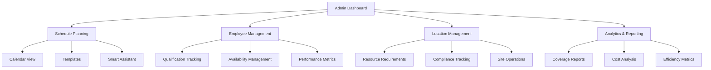
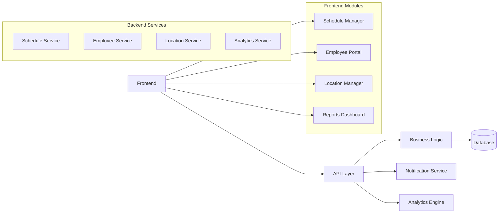
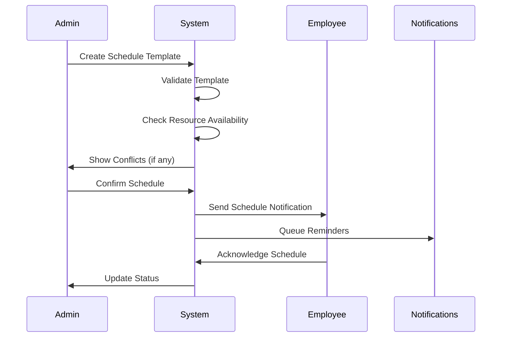
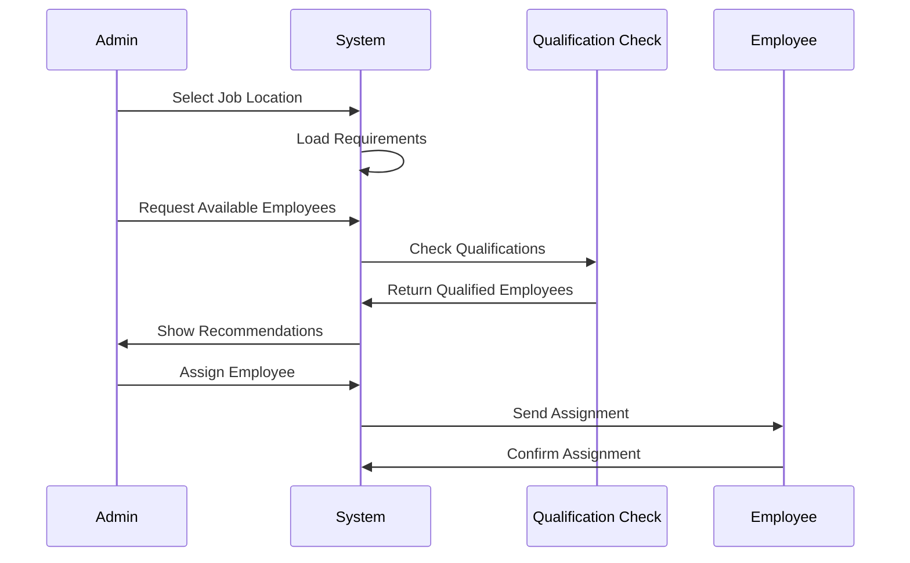
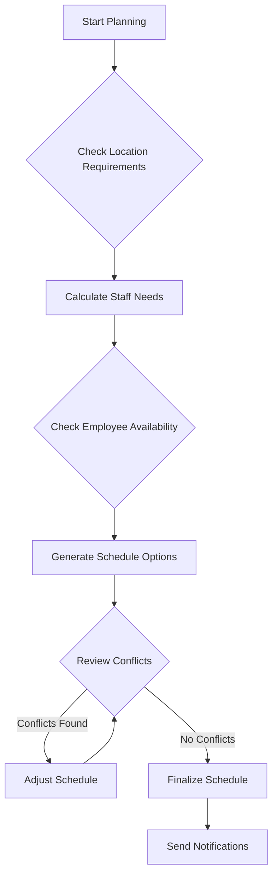
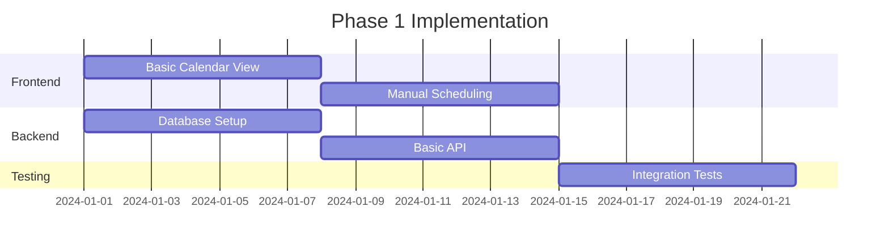
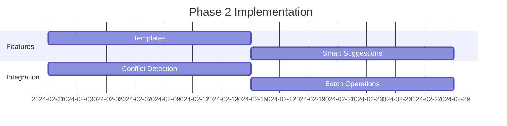

# Admin Workflow Enhancement Proposal
## Employee Time Tracking App

## Table of Contents
1. [Overview](#overview)
2. [System Architecture](#system-architecture)
3. [Core Workflows](#core-workflows)
4. [Implementation Phases](#implementation-phases)
5. [Technical Specifications](#technical-specifications)

## Overview

This document outlines proposed enhancements to the admin/manager workflow for employee scheduling and job site assignment management.

### Key Objectives
- Streamline scheduling process
- Reduce administrative overhead
- Ensure optimal resource allocation
- Improve compliance tracking
- Enhance employee satisfaction



## System Architecture

### Core Components



## Core Workflows

### 1. Schedule Creation Workflow



### 2. Employee Assignment Workflow



### 3. Resource Planning Workflow



## Implementation Phases

### Phase 1: Core Scheduling (Weeks 1-4)


### Phase 2: Smart Features (Weeks 5-8)


## Technical Specifications

### Data Models

```typescript
interface EmployeeType {
  id: string;
  name: string;
  description: string;
  qualifications: string[];
  allowedJobLocations: string[];
}

interface Employee {
  id: string;
  firstName: string;
  lastName: string;
  email: string;
  phone: string;
  employeeType: EmployeeType;
  preferredLocations?: string[];
  maxHoursPerWeek: number;
  availability: {
    [day: string]: {
      available: boolean;
      hours: string[];
    };
  };
}

interface JobLocation {
  id: string;
  name: string;
  address: string;
  requiredEmployeeTypes: {
    employeeTypeId: string;
    minEmployees: number;
    preferredEmployees: number;
  }[];
  operatingHours: {
    [day: string]: {
      open: string;
      close: string;
    };
  };
}
```

### API Endpoints

#### Schedule Management
```typescript
// Create Schedule Template
POST /api/schedules/templates
Body: ScheduleTemplate

// Get Available Employees
GET /api/schedules/available-employees
Query: {
  locationId: string;
  date: string;
  shift: string;
}

// Assign Employee to Shift
POST /api/schedules/assignments
Body: {
  employeeId: string;
  shiftId: string;
}
```

#### Employee Management
```typescript
// Update Employee Availability
PUT /api/employees/{id}/availability
Body: AvailabilityUpdate

// Get Employee Qualifications
GET /api/employees/{id}/qualifications

// Update Employee Preferences
PUT /api/employees/{id}/preferences
Body: PreferencesUpdate
```

### UI Components

#### Schedule Calendar
```typescript
interface ScheduleCalendar {
  view: 'day' | 'week' | 'month';
  filters: {
    locations: string[];
    employeeTypes: string[];
    status: string[];
  };
  events: ScheduledShift[];
  onEventClick: (event: ScheduledShift) => void;
  onDrop: (event: ScheduledShift, date: Date) => void;
}
```

#### Employee Selector
```typescript
interface EmployeeSelector {
  locationId: string;
  shift: {
    start: Date;
    end: Date;
  };
  filters: {
    qualifications: string[];
    availability: boolean;
    maxDistance?: number;
  };
  onSelect: (employee: Employee) => void;
}
```

## Benefits and ROI

### Efficiency Improvements
- 60% reduction in scheduling time
- 90% reduction in scheduling conflicts
- 40% improvement in resource utilization

### Cost Savings
- Reduced overtime costs
- Better staff utilization
- Lower administrative overhead

### Employee Satisfaction
- Improved schedule predictability
- Better work-life balance
- Faster response to schedule changes

## Next Steps

1. Review and approve design
2. Prioritize features for Phase 1
3. Create detailed technical specifications
4. Begin implementation of core features
5. Plan user training and rollout

## Questions and Feedback

Please provide feedback on:
1. Priority of features
2. Implementation timeline
3. Additional requirements
4. Integration needs
5. Training requirements
